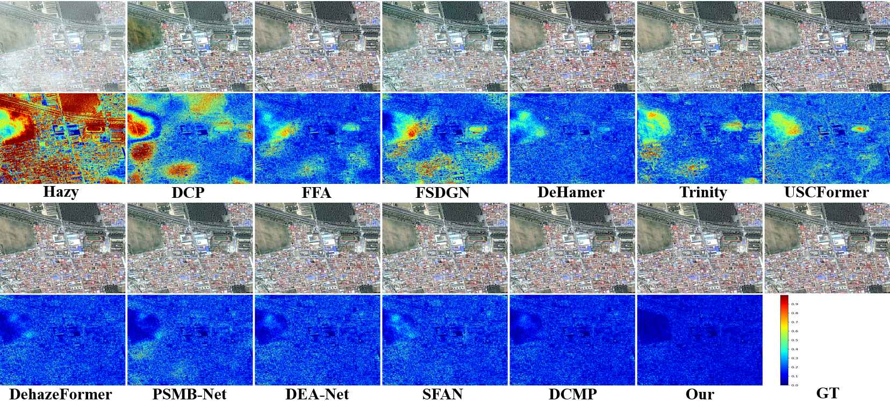

# BMFT-Net

### Dependences

1.Pytorch 1.8.0  
2.python 3.8  
3.CUDA 11.7  
4.Ubuntu 18.04

### Datasets Preparation
>./dataset/dataset_name/train
>>clean 
>>hazy

>./dataset/dataset_name/test
>>clean 
>>hazy

>./output_result

### 1.Train 

  <pre style="background - color: lightgray;"><code>
  python train.py --type 1 -train_batch_size 4 --gpus 0
  </code></pre>

### 2.Test 

  <pre style="background - color: lightgray;"><code>
  python test.py --type 1  --gpus 0
  </code></pre>

### 3.Clone the repo

  <pre style="background - color: lightgray;"><code>
  it clone https://github.com/zqf2024/BFMT-Net.git
  </code></pre>

# Visualization Results

