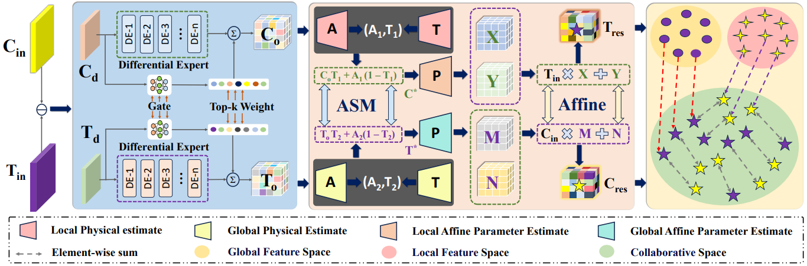

# &nbsp;&nbsp; Bidirectional-Modulation Frequency-Heterogeneous  &nbsp;&nbsp;&nbsp;&nbsp;&nbsp;&nbsp;&nbsp;&nbsp;Network for Remote Sensing Image Dehazing  &nbsp;&nbsp;&nbsp;&nbsp;&nbsp; &nbsp;&nbsp;&nbsp;&nbsp;&nbsp; &nbsp;&nbsp;&nbsp;&nbsp;&nbsp;&nbsp;&nbsp;&nbsp;&nbsp;&nbsp;&nbsp;&nbsp;&nbsp;&nbsp;&nbsp;&nbsp;&nbsp;&nbsp;(IEEE TCSVT 2025)

## Abstract

Abstract—Recently, deep neural networks have been exten-sively explored in remote sensing image haze removal and achieved remarkable performance. However, existing methods
fail to effectively fuse the features extracted from Convolu-tional Neural Networks (CNNs) and Transformer networks, leading to performance degradation. Moreover, most dehazing methods lack further exploration of the distinct properties of high- and low-frequency features, which are crucial for texture restoration and haze removal. To address these issues, we propose a Bidirectional-Modulation Frequency-Heterogeneous Network (BMFH-Net). Speciffcally, we propose a Differential-Expert Guided Bidirectional Modulation (DGBM) module that incorporates Differential experts and physical inversion models to exploit the complementarity of CNN-Transformer features and extract their latent haze-related physical characteristics, thereby enabling more effective bidirectional alignment. Furthermore, a Wavelet Frequency Heterogeneous Enhancement (WFHE) Mod-ule is designed to capture the most representative high-frequency features to reffne image texture details, while enhancing the global perception of haze and reconstructing structural information during low-frequency processing. Experiments on challenging remote sensing image datasets demonstrate our BMFH-Net outperforms several state-of-the-art haze removal methods.

## Overall architecture

## Differential-Expert Guided Bidirectional Modulation module

## Wavelet Frequency Heterogeneous Enhancement module

## Quantitative results🔥
<b>COMPARISON OF OUR METHOD AGAINST OTHERS ON THE STATEHAZE1K DATASET. ↑ INDICATES HIGHER IS BETTER. THE RED,
GREEN AND BLUE FONTS REPRESENT THE FIRST, SECOND AND THIRD RANKINGS IN TERMS OF PSNR OR SSIM.</b> 

<b>COMPARISON RESULTS OF OUR METHOD WITH OTHER ADVANCED METHODS ON THE RICE AND RSID DATASETS.↑ INDICATES HIGHER IS BETTER. THE RED,
GREEN AND BLUE FONTS REPRESENT THE FIRST, SECOND AND THIRD RANKINGS IN TERMS OF PSNR OR SSIM.</b> 

## Qualitative results🔥

### Results on Haze1k-thick remote sensing Dehazing Challenge testing images  
 

### Results on RICE1 remote sensing Dehazing Challenge testing images  
 

### Results on RICE2 remote sensing Dehazing Challenge testing images  
 

### Results on RSID remote sensing Dehazing Challenge testing images

### Dependences

1.Pytorch 1.8.0  
2.python 3.8  
3.CUDA 11.7  
4.Ubuntu 18.04

### Datasets Preparation
>./dataset/dataset_name/train
>>clean 
>>hazy

>./dataset/dataset_name/test
>>clean 
>>hazy

>./output_result

### 1.Train 

  <pre style="background - color: lightgray;"><code>
  python train.py --type 1 -train_batch_size 4 --gpus 0
  </code></pre>

### 2.Test 

  <pre style="background - color: lightgray;"><code>
  python test.py --type 1  --gpus 0
  </code></pre>

### 3.Clone the repo

  <pre style="background - color: lightgray;"><code>
  it clone https://github.com/zqf2024/BFMT-Net.git
  </code></pre>

